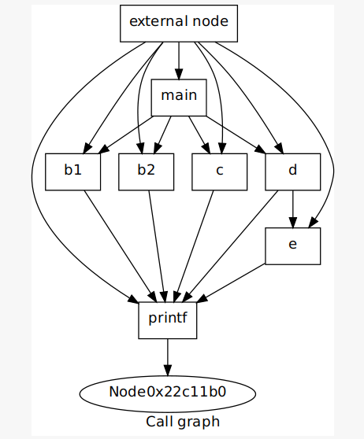

# Extract CFG

Let's generate bitcode.

```
clang -emit-llvm hello_2.c -c
```

We will get bitcode file hello_2.bc.


We will print the control flow graph.
```
opt -dot-cfg hello_2.bc
```

Then view it using xdot.
```
xdot .main.dot
```

The result is as follow.


We can also try to use callgraph.
```
clang -emit-llvm cg.c -c
opt -dot-callgraph cg.bc
xdot callgraph.dot
```

We can see the callgraph as follow.


